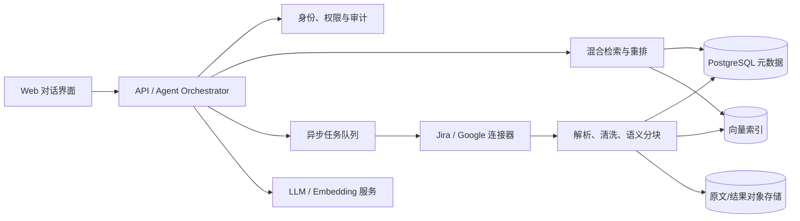

# AI 需求整理 Agent：产品与技术方案

> 当前状态：已完成第一个可运行的后端技术切片，包括统一来源模型、幂等分块入库、租户/ACL 过滤、中文与英文混合检索、元数据过滤和带引用的抽取式回答。Jira/Google OAuth 与模型生成仍在后续迭代中。

## 快速开始

项目当前仅使用 Python 标准库，测试需要 Python 3.11+ 与 pytest：

```bash
python -m pip install -e .
pytest -q
```

可以通过 CLI 导入一个统一格式的 JSON 文件并检索：

```bash
requirements-agent --database requirements.db ingest-json example.json
requirements-agent --database requirements.db ask \
  --tenant acme --principal user:alice "哪些需求与部分退款有关？"
```

JSON 字段与下文“统一需求记录”相对应；当前实现还要求提供 `text`、`allowed_principals`，并将来源自定义字段放入 `metadata`。核心代码位于 `src/requirements_agent`，端到端行为测试位于 `tests/test_requirements_service.py`。

## 1. 目标

构建一个面向大量需求资料的对话式 AI Agent。用户授权 Jira 空间（项目）或 Google Drive 中的文档后，系统持续同步需求内容；用户可以用自然语言完成检索、归类、去重、总结、对比和结构化输出，并能追溯每条结论的原始出处。

这个产品的核心不是把所有资料一次性塞进模型上下文，而是通过 **增量同步 + 结构化存储 + 混合检索（RAG）+ 分批归纳**，在数据量较大时仍保持结果可靠、可解释且成本可控。

## 2. 典型使用场景

- “按业务模块整理最近两个季度的需求，并给出每个模块的需求数量。”
- “找出含义重复或互相冲突的需求，列出判断理由和原文链接。”
- “汇总所有与支付风控相关的 P0/P1 需求，生成本周评审清单。”
- “比较 Jira 中的实现状态与 PRD 中的规划，指出遗漏项。”
- “根据这些资料生成一份产品需求摘要、版本范围或管理层周报。”
- “将结果导出为 Markdown、CSV，或回写到 Google Docs/Jira。”

## 3. MVP 范围

### 3.1 必须支持

1. **数据接入**
   - Jira：通过 OAuth/API 选择站点与项目，读取 Epic、Story、Task、Bug、字段、评论和关联关系。
   - Google Drive/Docs：通过 OAuth 选择文件夹或文档，读取标题、正文、表格及更新时间。
   - 支持首次全量导入，以及按 `updated_at`/变更游标进行增量同步。
2. **资料处理**
   - 保留来源、文档层级、更新时间、负责人、状态、优先级等元数据。
   - 根据标题、段落、Issue 或表格行进行语义分块，而不是仅按固定字符数切割。
   - 对文本生成向量，并建立关键词索引。
3. **对话与整理**
   - 支持带过滤条件的问答（来源、项目、时间、状态、负责人、标签）。
   - 支持摘要、分类、去重候选、冲突候选和表格化输出。
   - 每个关键结论附 Jira Issue 或 Google 文档的来源链接和引用片段。
4. **任务体验**
   - 小查询实时返回；大范围整理作为异步任务运行，展示进度并允许下载结果。
   - 保存会话、查询范围和生成结果，用户可以继续追问。
5. **权限与审计**
   - 检索前校验当前用户可访问的数据范围，不能仅依靠前端隐藏内容。
   - 记录同步、查询、生成与导出操作；支持删除数据和撤销第三方授权。

### 3.2 MVP 暂不包含

- 自动修改需求状态或批量关闭 Jira Issue。
- 在未经用户确认时自动回写原始资料。
- 复杂的跨企业知识图谱、自动项目排期或工作量承诺。
- 用模型输出替代正式的需求评审和合规审批。

## 4. 产品工作流

1. 用户登录并创建一个“知识空间”。
2. 连接 Jira 或 Google Drive，选择允许同步的数据范围。
3. 后台拉取资料、解析、去重、分块并建立索引；界面显示同步进度和失败项。
4. 用户在对话前选择查询范围，或直接使用当前知识空间的默认范围。
5. Agent 先理解任务，再检索证据；对于全量统计或大规模归纳，创建分批处理任务。
6. 系统输出答案、结构化表格、覆盖范围及引用；证据不足时明确说明，不猜测。
7. 用户可调整分类维度、补充约束、导出结果，或确认后回写目标系统。

## 5. 推荐架构



建议的初始技术选型：

- 前端：Next.js/React，提供对话、来源筛选、同步状态、引用预览和结果导出。
- 后端：Python FastAPI 或 TypeScript NestJS；Agent 编排使用明确的工具调用和状态机，避免完全自由的循环。
- 数据：PostgreSQL 保存租户、权限、来源与任务；`pgvector` 可满足早期向量检索，规模增长后再评估独立向量库。
- 队列：Redis + Celery/BullMQ，用于同步、嵌入和大批量归纳任务。
- 文件：兼容 S3 的对象存储保存原始快照与导出文件。
- 模型层：封装统一接口，使对话模型、嵌入模型和重排模型可以独立替换。

## 6. 数据与索引设计

### 6.1 核心实体

| 实体 | 关键字段 | 用途 |
| --- | --- | --- |
| `workspace` | `id`, `tenant_id`, `name` | 隔离一个知识空间 |
| `connector` | `type`, `encrypted_credential`, `scope`, `cursor` | 保存连接配置与同步游标 |
| `source_item` | `external_id`, `url`, `title`, `version`, `updated_at`, `acl` | 对应一个 Issue 或文档 |
| `chunk` | `source_item_id`, `text`, `heading_path`, `metadata`, `embedding` | 检索的最小证据单元 |
| `sync_run` | `status`, `cursor`, `counts`, `error` | 监控每次同步 |
| `conversation` | `user_id`, `scope`, `messages` | 保存对话与检索范围 |
| `analysis_job` | `type`, `input_scope`, `status`, `result_uri` | 执行大规模整理任务 |

### 6.2 统一需求记录

不同来源进入系统后，映射为统一字段：

```json
{
  "requirement_id": "jira:PROJ-123",
  "title": "支持订单部分退款",
  "description": "...",
  "source_type": "jira",
  "source_url": "https://example.atlassian.net/browse/PROJ-123",
  "project": "PROJ",
  "status": "In Review",
  "priority": "P1",
  "owner": "user-id",
  "labels": ["payment"],
  "updated_at": "2026-08-13T00:00:00Z",
  "acl": ["group:product"]
}
```

原始字段仍应以 JSON 形式保留，以免统一映射丢失业务信息。

## 7. 大数据量下的 Agent 策略

### 7.1 问答类请求

1. 从用户问题提取来源、项目、日期、状态等过滤条件。
2. 同时执行全文关键词检索与向量检索。
3. 合并、去重并重排候选证据。
4. 只将最相关片段及必要的上下文发送给模型。
5. 校验答案中的引用 ID 必须来自实际检索结果。

### 7.2 全量整理类请求

“总结全部 5 万条需求”不适合普通 RAG。应使用 Map-Reduce 式流水线：

1. 先按项目、Epic、时间或语义主题分组。
2. 每组独立提取统一结构（主题、诉求、优先级、风险、来源 ID）。
3. 将中间结果持久化，失败时只重试对应分组。
4. 对中间结果逐层合并，并用数据库计算精确数量。
5. 最终生成报告，同时展示已处理、跳过、失败的数据数量。

### 7.3 去重与冲突检测

- 先用向量相似度找候选对，再让模型做语义判定，避免对全部记录进行两两比较。
- 输出“重复/可能重复/不重复”或“冲突/可能冲突”的置信等级、理由和双方来源。
- 不自动删除或合并原始需求；由用户确认后再执行写操作。

## 8. Agent 工具边界

Agent 可调用的工具应窄而明确，例如：

- `search_requirements(query, filters, limit)`
- `get_source_item(source_id)`
- `aggregate_requirements(group_by, filters, metrics)`
- `start_analysis_job(job_type, scope, output_schema)`
- `get_analysis_job(job_id)`
- `export_result(format)`
- `write_back_draft(target, content)`（默认仅生成草稿，确认后执行）

所有工具必须在服务端应用租户和用户 ACL；模型提供的 `workspace_id`、过滤条件或外部 ID 均不能被直接信任。

## 9. 可靠性、安全与成本

- **可追溯性**：答案中引用固定的来源版本；源数据更新后标记旧答案可能已过期。
- **防提示注入**：把来源文档视为不可信数据，不执行文档中要求 Agent 改变规则或调用工具的指令。
- **最小权限**：OAuth 只申请必要只读权限；写权限在回写功能上线时单独申请。
- **凭证保护**：令牌加密保存，密钥由 KMS 管理，日志中禁止出现令牌和完整敏感正文。
- **数据隔离**：所有记录包含 `tenant_id`，数据库查询、缓存键、向量索引和对象存储路径均按租户隔离。
- **保留策略**：支持连接器断开、原文删除、向量删除和审计记录保留期配置。
- **成本控制**：内容哈希未变化时不重新嵌入；缓存检索与中间摘要；设置单任务条数、token 和费用上限。
- **质量降级**：连接器限流时指数退避；模型不可用时保留任务并重试，而不是返回无引用的猜测答案。

## 10. 质量指标与验收标准

| 维度 | MVP 验收建议 |
| --- | --- |
| 同步完整性 | 抽样数据中标题、正文、关键字段和原文链接正确率 ≥ 99% |
| 增量同步 | 来源更新后在约定同步窗口内可被查询，且不产生重复记录 |
| 引用有效性 | 生成答案中的引用都能打开到用户有权限查看的来源 |
| 检索质量 | 建立不少于 100 个真实问题的评测集，持续记录 Recall@K / nDCG |
| 摘要忠实度 | 人工评审中关键结论均能由所附证据支持 |
| 权限隔离 | 自动化测试证明跨租户、撤权用户和未授权来源均无法检索 |
| 可恢复性 | 分批任务中途失败后可从检查点继续，不重复计数 |
| 可观测性 | 能按租户/任务查看耗时、token、费用、失败原因和数据覆盖率 |

## 11. 分阶段实施计划

具体的迭代节奏、任务拆分、验收门槛和风险应对见 [`DEVELOPMENT_PLAN.md`](DEVELOPMENT_PLAN.md)。该计划以 8 周 MVP 为基线，可在完成第 0 周的范围确认后按团队容量调整。

### 阶段 1：可验证原型（2–3 周）

- 选一个 Jira 项目和少量 Google 文档完成手动/只读导入。
- 实现统一数据模型、混合检索、带引用问答。
- 用 30–50 个真实问题建立第一版离线评测集。

### 阶段 2：MVP（4–6 周）

- 完成 OAuth、范围选择、增量同步、权限过滤和同步监控。
- 加入对话历史、筛选器、异步全量整理、Markdown/CSV 导出。
- 完成租户隔离、审计、删除流程和基础成本看板。

### 阶段 3：增强版

- 增加重复/冲突检测、可配置报告模板、用户反馈闭环。
- 在明确确认流程后支持回写草稿。
- 根据真实评测和规模瓶颈决定是否引入独立搜索或向量基础设施。

## 12. 开工前需要确认的问题

1. Jira 使用 Cloud 还是 Data Center？“空间”具体指站点、项目还是某个筛选器？
2. Google 侧只有 Docs，还是也包含 Sheets、Slides、PDF 和共享云端硬盘？
3. 预计文档/Issue 数量、日更新量、单文档最大长度和并发用户数是多少？
4. 用户最优先的三个输出是什么：分类表、PRD 摘要、重复项、冲突项、周报，还是版本规划？
5. 是否需要严格继承 Jira/Drive 的逐用户权限，还是每个知识空间内成员共享全部已导入内容？
6. 数据能否发送到第三方模型服务？是否有地区、保留期、脱敏或私有化部署要求？
7. 输出只需下载，还是要回写 Jira/Google Docs？回写操作由谁审批？
8. 可接受的同步延迟、单次分析等待时间和月度模型预算是多少？

建议先用真实数据回答这些问题，再锁定模型、向量库等技术细节；其中 **权限模型、数据规模和首要输出模板** 会直接影响整体设计。
